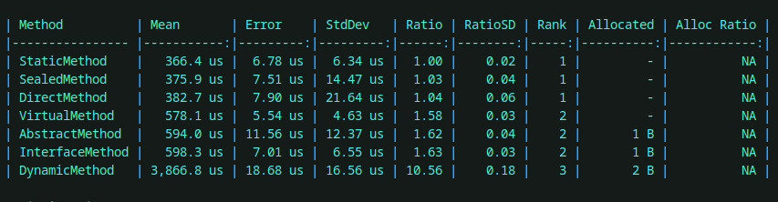

# مقایسه کارایی روش‌های مختلف چندشکلی (Polymorphism) در #C

در این ریپازیتوری به بررسی روش‌های مختلف پیاده‌سازی چندشکلی (Polymorphism) در زبان #C و مقایسه عملکرد آن‌ها می‌پردازیم. هر روش با مکانیزم‌های متفاوت Dispatch و دستورات IL مخصوص خود اجرا می‌شود، که تأثیر قابل‌توجهی بر سرعت اجرا، توانایی درون‌یابی (inlining) و استفاده از حافظه دارد. از متدهای virtual و رابط‌ها (interfaces) که با callvirt پیاده‌سازی می‌شوند تا متدهای ایستا (static) که از دستور call بهره می‌برند، هر کدام ساختار و هزینه‌ی اجرایی خاص خود را دارند.

---
## پیش مفاهیم
### -Dispatch
در سی‌شارپ، ارسال (Dispatch) به فرآیندی اشاره دارد که زمان فراخوانی یک متد، CLR (Common Language Runtime) تعیین می‌کند کدام پیاده‌سازی متد را اجرا کند. دو نوع اصلی ارسال وجود دارد:

ارسال ایستا (Static Dispatch):

متد در زمان کامپایل (Compile Time) به‌طور کامل مشخص و ثابت می‌شود. این حالت برای متدهای غیرمجازی (non-virtual)، خصوصی (private)، و استاتیک (static) صادق است.

ارسال پویا (Dynamic Dispatch):

انتخاب متد در زمان اجرا (Run Time) و بر اساس نوع واقعی شیء صورت می‌پذیرد. این ارسال در پیاده‌سازی‌یابی آرایه‌ای (v-table) برای متدهای virtual/override و همچنین در استفاده از کلمه‌کلیدی dynamic به کار می‌رود.

### -vtable

در سی‌شارپ، جدول متد مجازی (vtable) مکانیزمی است برای پیاده‌سازی ارسال پویا (dynamic dispatch) که امکان فراخوانی نسخهٔ مناسب متد بر اساس نوع واقعی شیء را فراهم می‌کند. هر کلاس دارای یک آرایه از اشاره‌گرها به پیاده‌سازی متدهای virtual خود است که کامپایلر سی‌شارپ هنگام بیلد، اطلاعات مربوط به آن را در متادیتای اسمبلی قرار می‌دهد. در دات‌نت، هر شیء شامل یک اشاره‌گر پنهان (vpointer) به ابتدای جدول متد خودش است که توسط دستور IL callvirt برای فراخوانی غیرمستقیم استفاده می‌شود. این ساختار برای کلاس‌هایی که متد virtual یا override دارند به‌طور خودکار ایجاد می‌شود و امکان چندریختی در زمان اجرا را فراهم می‌کند.

### -Inlining 

در C#، درون‌یابی (Inlining) به فرآیندی اشاره دارد که در آن کامپایلر یا JIT، فراخوانی متد را با بدنهٔ آن جایگزین می‌کند تا سربار فراخوانی کاهش یابد، دسترسی به متغیرها بهینه شود و فرصت‌های بهینه‌سازی‌های بعدی فراهم گردد. این به‌طور پیش‌فرض توسط JIT در زمان اجرا و بر اساس مجموعه‌ای از قواعد (اندازهٔ IL، پیچیدگی جریان کنترل، تعداد پارامترها و…) انجام می‌شود. از سوی دیگر، توسعه‌دهنده می‌تواند با صفت‌های MethodImplOptions.AggressiveInlining یا NoInlining به JIT پیشنهاد یا دستور بدهد که یک متد حتماً یا هیچ‌گاه درون‌یابی نشود. اما استفاده از این صفت‌ها باید با احتیاط باشد؛ درون‌یابی بی‌رویه می‌تواند اندازهٔ کد را افزایش داده، کش‌های پروسسور را تحت فشار قرار دهد و در نهایت منجر به کاهش کارایی شود.

---
برای دیدن فایل مقایسه متد ها [اینجا](PolymorphismBenchmarks/BenchmarkSetup.cs) رو ببینید...

تصویر زیر حاوی اطلاعات مقایسه پیاده سازی های مختلف است...

